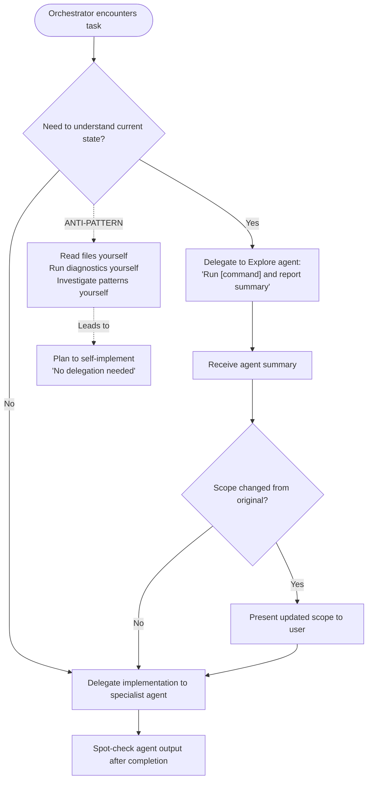
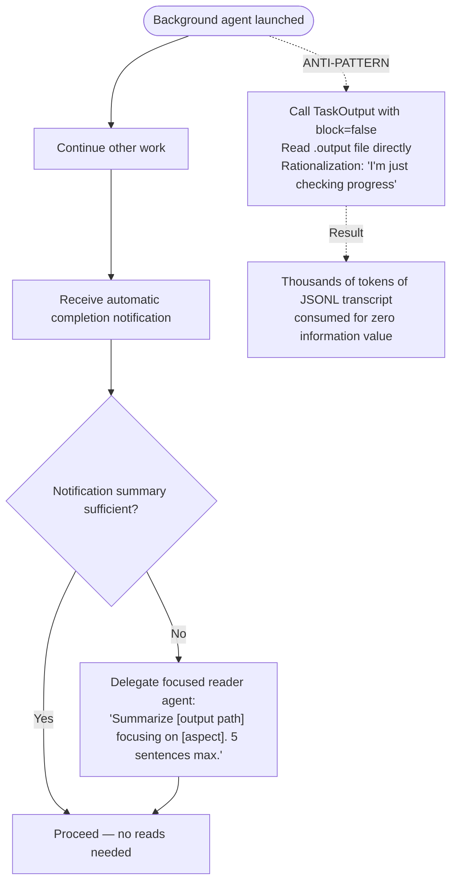

<!-- gitnexus:start -->
# GitNexus — Code Intelligence

This project is indexed by GitNexus as **SkillSpoke-ddv** (453 symbols, 632 relationships, 9 execution flows). Use the GitNexus MCP tools to understand code, assess impact, and navigate safely.

> If any GitNexus tool warns the index is stale, run `npx gitnexus analyze` in terminal first.

## Always Do

- **MUST run impact analysis before editing any symbol.** Before modifying a function, class, or method, run `gitnexus_impact({target: "symbolName", direction: "upstream"})` and report the blast radius (direct callers, affected processes, risk level) to the user.
- **MUST run `gitnexus_detect_changes()` before committing** to verify your changes only affect expected symbols and execution flows.
- **MUST warn the user** if impact analysis returns HIGH or CRITICAL risk before proceeding with edits.
- When exploring unfamiliar code, use `gitnexus_query({query: "concept"})` to find execution flows instead of grepping. It returns process-grouped results ranked by relevance.
- When you need full context on a specific symbol — callers, callees, which execution flows it participates in — use `gitnexus_context({name: "symbolName"})`.

## Never Do

- NEVER edit a function, class, or method without first running `gitnexus_impact` on it.
- NEVER ignore HIGH or CRITICAL risk warnings from impact analysis.
- NEVER rename symbols with find-and-replace — use `gitnexus_rename` which understands the call graph.
- NEVER commit changes without running `gitnexus_detect_changes()` to check affected scope.

## Resources

| Resource | Use for |
|----------|---------|
| `gitnexus://repo/SkillSpoke-ddv/context` | Codebase overview, check index freshness |
| `gitnexus://repo/SkillSpoke-ddv/clusters` | All functional areas |
| `gitnexus://repo/SkillSpoke-ddv/processes` | All execution flows |
| `gitnexus://repo/SkillSpoke-ddv/process/{name}` | Step-by-step execution trace |

## CLI

| Task | Read this skill file |
|------|---------------------|
| Understand architecture / "How does X work?" | `.claude/skills/gitnexus/gitnexus-exploring/SKILL.md` |
| Blast radius / "What breaks if I change X?" | `.claude/skills/gitnexus/gitnexus-impact-analysis/SKILL.md` |
| Trace bugs / "Why is X failing?" | `.claude/skills/gitnexus/gitnexus-debugging/SKILL.md` |
| Rename / extract / split / refactor | `.claude/skills/gitnexus/gitnexus-refactoring/SKILL.md` |
| Tools, resources, schema reference | `.claude/skills/gitnexus/gitnexus-guide/SKILL.md` |
| Index, status, clean, wiki CLI commands | `.claude/skills/gitnexus/gitnexus-cli/SKILL.md` |

<!-- gitnexus:end -->

<!-- BEGIN BEADS INTEGRATION v:1 profile:minimal hash:6cd5cc61 -->
## Beads Issue Tracker

This project uses **bd (beads)** for issue tracking. Run `bd prime` to see full workflow context and commands.

### Quick Reference

```bash
bd ready              # Find available work
bd show <id>          # View issue details
bd update <id> --claim  # Claim work
bd close <id>         # Complete work
```

### Rules

- Use `bd` for ALL task tracking — do NOT use TodoWrite, TaskCreate, or markdown TODO lists
- Run `bd prime` for detailed command reference and session close protocol
- Use `bd remember` for persistent knowledge — do NOT use MEMORY.md files

**Architecture in one line:** issues live in a local Dolt DB; sync uses `refs/dolt/data` on your git remote; `.beads/issues.jsonl` is a passive export. See https://github.com/gastownhall/beads/blob/main/docs/SYNC_CONCEPTS.md for details and anti-patterns.

## Agent Context Profiles

The managed Beads block is task-tracking guidance, not permission to override repository, user, or orchestrator instructions.

- **Conservative (default)**: Use `bd` for task tracking. Do not run git commits, git pushes, or Dolt remote sync unless explicitly asked. At handoff, report changed files, validation, and suggested next commands.
- **Minimal**: Keep tool instruction files as pointers to `bd prime`; use the same conservative git policy unless active instructions say otherwise.
- **Team-maintainer**: Only when the repository explicitly opts in, agents may close beads, run quality gates, commit, and push as part of session close. A current "do not commit" or "do not push" instruction still wins.

## Session Completion

This protocol applies when ending a Beads implementation workflow. It is subordinate to explicit user, repository, and orchestrator instructions.

1. **File issues for remaining work** - Create beads for anything that needs follow-up
2. **Run quality gates** (if code changed) - Tests, linters, builds
3. **Update issue status** - Close finished work, update in-progress items
4. **Handle git/sync by active profile**:
   ```bash
   # Conservative/minimal/default: report status and proposed commands; wait for approval.
   git status

   # Team-maintainer opt-in only, unless current instructions forbid it:
   git pull --rebase
   git push
   git status
   ```
5. **Hand off** - Summarize changes, validation, issue status, and any blocked sync/commit/push step

**Critical rules:**
- Explicit user or orchestrator instructions override this Beads block.
- Do not commit or push without clear authority from the active profile or the current user request.
- If a required sync or push is blocked, stop and report the exact command and error.
<!-- END BEADS INTEGRATION -->

<!-- BEGIN BEADS CODEX SETUP: generated by bd setup codex -->
## Beads Issue Tracker

Use Beads (`bd`) for durable task tracking in repositories that include it. Use the `beads` skill at `.agents/skills/beads/SKILL.md` (project install) or `~/.agents/skills/beads/SKILL.md` (global install) for Beads workflow guidance, then use the `bd` CLI for issue operations.

### Quick Reference

```bash
bd ready                # Find available work
bd show <id>            # View issue details
bd update <id> --claim  # Claim work
bd close <id>           # Complete work
bd prime                # Refresh Beads context
```

### Rules

- Use `bd` for all task tracking; do not create markdown TODO lists.
- Run `bd prime` when Beads context is missing or stale. Codex 0.129.0+ can load Beads context automatically through native hooks; use `/hooks` to inspect or toggle them.
- Keep persistent project memory in Beads via `bd remember`; do not create ad hoc memory files.

**Architecture in one line:** issues live in a local Dolt DB; sync uses `refs/dolt/data` on your git remote; `.beads/issues.jsonl` is a passive export. See https://github.com/gastownhall/beads/blob/main/docs/SYNC_CONCEPTS.md for details and anti-patterns.
<!-- END BEADS CODEX SETUP -->

<!-- BEGIN SKILLSPOKE SHARED: written by `polyrepo agents-sync` from repositories/agents-shared-block.md in the SkillSpoke repo; edit it there -->
## SkillSpoke: instructions shared by every repository

SkillSpoke is a personal job-search agent: it does the job search on the seeker's behalf, and
every capability serves the job seeker. This repository is one of the project's repositories;
the SkillSpoke command-and-control repository (`$SKILLSPOKE_CC`) holds the instructions that
apply across all of them.

- **Who works here.** The owner is the only human. Claude Code wrote all of the code and
  documentation, so anything found here, finished or not, is Claude Code's to own and fix.
- **Repository facts.** Ask the `polyrepo-steward` agent for anything about a repository
  other than its contents: which repo owns a function, where a repo is, whether it is up to
  date with GitHub, creating, renaming or deprecating one.
- **Repository names.** `SkillSpoke-{name}` is the personal-agent app; `shared-{name}` is
  shared across the whole company; `marketing-{name}` is marketing; `employer-{name}` is the
  employer app. A repo is never deleted: it is deprecated by renaming it `deprecated-{name}`
  in lowercase, and archived on GitHub 60 days later.
- **Project documentation** (product, architecture, research, glossary) lives in the
  `skillspoke-docs` Obsidian vault. The architecture is the arc42 SAD under
  `docs/tech/architecture/arc42/` in the vault.
- **Commits.** `type(scope): description`, no `Co-Authored-By`. `--no-verify` is forbidden:
  when a pre-commit hook fails, fix every finding and commit again.
- **Errors stay visible.** `2>/dev/null` is not used in hooks, scripts or commands.
- **Platform rules.** Lambda handlers use `aws-lambda-powertools` (FastAPI, Flask and Django
  are banned). API Gateway is REST API v1 (HTTP API v2 is banned).
- **Service isolation.** A service never imports another service's code, never shares a
  DynamoDB table with another service, and never uses CloudFormation exports for
  cross-stack references (SSM Parameter Store is used instead).
- **Issue tracking** is beads (`bd`).
<!-- END SKILLSPOKE SHARED -->

<!-- BEGIN AGENT TEAMS WORKFORCE: written by `polyrepo agents-sync` from agents-file.md in the agent-teams-workforce plugin; edit it there -->
## Instructions for Agent Teams Workforce

This project uses Agent Teams Workforce (the `agent-teams-workforce` plugin): bounded
specialist agents that run the SDLC through workflow scripts, with maker, checker and approver
kept separate.

- **SDLC pipelines, workflow scripts, agent taxonomy, teams, full roster:**
  `AGENT-TEAMS-WORKFORCE.md` at the root of the installed plugin. The installed plugin root is
  the `installPath` of `agent-teams-workforce@mark-satterfield` in
  `$CLAUDE_CONFIG_DIR/plugins/installed_plugins.json` (`$CLAUDE_CONFIG_DIR` defaults to
  `~/.claude`).
- **Commands:** the plugin's slash commands, `/agent-teams-workforce:<command>`.

# Orchestrator Context Window Discipline

These rules enforce delegation discipline for the orchestrator role. The orchestrator's context window is a shared, finite resource across the entire session. Agents get fresh context per task — the orchestrator does not.

---

## Context Window Read Constraints

**ORCHESTRATOR reads — PERMITTED**:

- Task status (TaskList, TaskGet) for routing decisions
- Agent output artifacts to verify after delegation
- Host-project backlog items, plan files, skill/agent config files, CLAUDE.md
- Files you will Edit or Write in this same turn

**ORCHESTRATOR reads — NEVER** (hard constraint, no exceptions):

- Source code files (`.py`, `.js`, `.ts`, `.go`, `.rs`, `.rb`, `.java`) you will not edit this turn
- Config files (`.toml`, `.yaml`, `.yml`, `.json`) you will not edit this turn
- Test files
- Output from diagnostic commands (`ty check`, `ruff check`, `mypy`, `pytest`, `eslint`, `cargo check`)
- Agent `.output` files or JSONL transcripts — use the completion notification summary instead
- `TaskOutput` with `block=false` on a running agent — the completion notification arrives automatically

**Falsifiable test before every Read/Grep/Bash on a source or config file**:

> "Will I Edit or Write this file in this turn?" If NO — pass the path to an agent instead.

---

## Delegation Constraints

**No exemption categories**: "config changes", "small edits", "just TOML/YAML", and "only 2 lines" are not valid reasons to skip delegation. The orchestrator delegates, agents implement. This applies regardless of file type, change size, or perceived simplicity.

**Never pre-gather data for agents**: Agents perform their own Chain of Verification. Provide outcomes, constraints, and file paths — not your analysis of those files.

**Never pre-read task files for agents**: If the agent needs to read a file, pass the file path. Pre-gathered summaries bypass agent verification, add stale data, and waste orchestrator context.

---

## Investigation Escalation Anti-Pattern

A validated failure mode where the orchestrator progressively reads more files, each justified by the previous read's findings, ending in self-implementation instead of delegation.

**Pattern sequence**:

1. "Let me check the current state" — seemingly legitimate baseline
2. "That changed things, let me verify" — scope creep from result
3. "Now I need to understand the pattern" — active investigation
4. "This is simple enough to do myself" — delegation bypass



**Trigger signal**: 3+ Read/Grep/Bash calls on source files without an intervening Edit/Write or Agent delegation.

**Response when triggered**: STOP. Write the file paths and observations gathered so far into a delegation prompt. Do not read one more file. Delegate.

---

## Agent Output Polling Anti-Pattern

A variant of investigation escalation where the orchestrator reads a running agent's output file mid-execution, rationalizing it as "checking progress." Same root cause — orchestrator reads instead of waiting or delegating.

**Observed in**: Session 77509a5e (2026-02-19, dasel plugin creation).

**Why polling is never valid**: The agent completion notification arrives automatically. There is no signal gap that polling fills. Raw agent transcripts are JSONL with full message payloads — enormous context cost for zero information value.

**Prohibited operations**:

- `TaskOutput` with `block=false` on a **running** agent
- `Read` on any `.output` file or agent JSONL transcript

**Rationalization phrase** (trigger signal, not justification):

> "I'm just checking progress" / "Let me see how the agent is doing" / "Let me peek at the current state"

**Correct workflow**:



**Connection**: Investigation escalation reads source files instead of delegating. Agent output polling reads agent transcripts instead of waiting. Both patterns share the identical fix: stop reading, use the delegation channel.

---

## Diagnostic Commands

The orchestrator MUST NOT run diagnostic commands that produce large output directly into its context window. These commands should be delegated to an Explore agent or specialist.

**Commands that must be delegated** (not run directly by the orchestrator):

- `ty check`, `ruff check`, `mypy`, `pyright`, `basedpyright`, `pylint`
- `pytest`, `pre-commit run`, `prek run`
- `eslint`, `tsc --noEmit`, `cargo check`, `cargo clippy`, `go vet`

**Exception**: Post-edit verification of a single file you just modified. Scope the check to that file only — never the entire codebase.

**Correct delegation pattern**:

```text
Delegate to Explore agent:
"Run [diagnostic command] and report:
 - Total count by diagnostic category
 - Affected file paths
 - Representative example of each category
 3 sentences maximum."
```

---

## Tool Use Denial Protocol (HARD STOP)

When ANY tool use is denied by the user:

1. STOP the current action sequence immediately — do not execute any further tools
2. State exactly what was denied and what you cannot do without it:
   `BLOCKED — [action] was denied. I cannot [goal] without [what you needed].`
3. Do NOT invent alternative paths, workarounds, or equivalent approaches
4. Do NOT retry with modified commands that achieve the same denied goal
5. Ask the user what they want to do next

**Reason**: Permission denial is a user boundary signal, not a technical obstacle to route around. Inventing workarounds (e.g., `git show FETCH_HEAD:` after `git checkout` was denied, or `git worktree` to create a shadow workspace) violates user trust and operates outside the user's awareness.

SOURCE: Session forensics 2026-03-02, session e3280e97 — two `git checkout` denials bypassed via `git show` + `git worktree` workaround; user discovered this only after the model had implemented changes in `/tmp/`.

---

## Bash Built-In Tool Enforcement

The orchestrator MUST use built-in Claude Code tools instead of Bash equivalents for file operations. A blocking PreToolUse hook (`prevent-bash-tool-misuse.cjs`) enforces this at the tool-call level.

**Commands blocked by hook** (use built-in tool instead):

- `grep pattern file` — use `Grep(pattern="...", path="...")`
- `find . -name "*.ts"` — use `Glob(pattern="**/*.ts")`
- `ls /some/dir` — use `Glob(pattern="*", path="/some/dir")`
- `cat file.txt` — use `Read(file_path="/path/to/file")`
- `head -20 file` — use `Read(file_path="...", limit=20)`
- `tail -20 file` — use `Read(file_path="...", offset=-20)`
- `sed -n '10,30p' file` — use `Read(file_path="...", offset=10, limit=20)`

**Legitimate Bash patterns** (hook does not block):

- Pipeline uses: `git log | grep`, `uv run ... | head`, `gh ... | grep`
- `cat /dev/stdin`, `cat -` (reading stdin)
- `ls -la` (human-readable directory listing)

**Kaizen evidence**: 28 violations in session e3280e97 (2026-03-02) — a 233-turn session with 0 agent delegations. Each violation was individually small but collectively they consumed significant context and prevented delegation to fresh-context agents.

SOURCE: Session e3280e97 transcript analysis, 2026-03-02.

---

## Epistemic Identity Scope

When operating as orchestrator, "use tools to verify" applies to task-routing information only:

- Skill documentation, host-project backlog items, agent configurations, CLAUDE.md — verify directly
- Source code, test files, diagnostic output — delegate to agents with fresh context

The verification imperative does not override the delegation constraint. Investigation is not the orchestrator's job.
<!-- END AGENT TEAMS WORKFORCE -->
